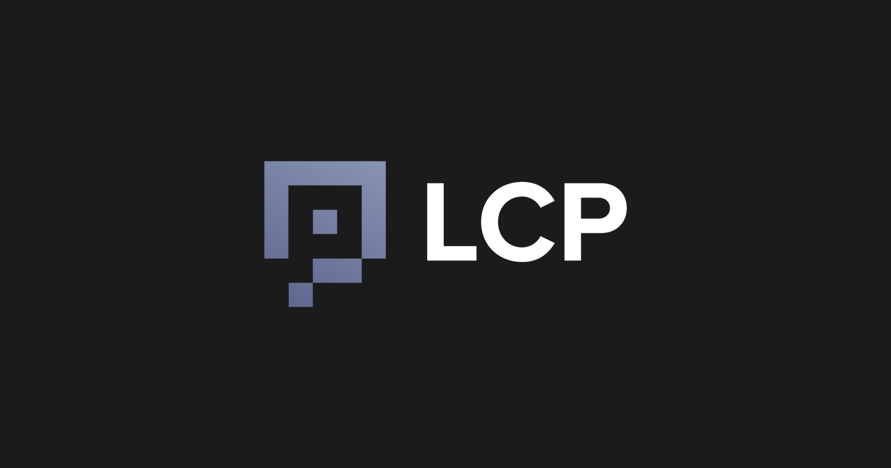

# LCP (Light Client Proxy)

  

**This software is still under heavy active development.**

LCP is a proxy for light client verification executed in TEE.

LCP uses Intel SGX, a representative TEE implementation, to provide light clients implemented in enclave. It also provides an on-chain client(called LCP Client) that verifies commitments indicating the results of verification by the light clients. In addition, LCP Client is compatible with [ICS-02](https://github.com/cosmos/ibc/tree/main/spec/core/ics-002-client-semantics), so LCP can be integrated with [IBC](https://github.com/cosmos/ibc).

The design of LCP is based on the following principles:

- Minimum trust assumptions: In addition to the trust assumptions of the Light Client scheme, which is the most secure verification scheme, LCP needs to add as little trust as possible, the TEE trust.
- Ultra efficient on-chain verification: A client on the downstream verifies a single signature on a resulting commitment generated in the Enclave instead of verifying the upstream. It will reduce the verification cost and the size of verification transactions (e.g., no need to include validators' info in the upstream).
- Extensible: No need for an on-chain light client implementation for each chain combination, only a light client implementation per chain that the Enclave can execute.

## Documentation

For the details, please see here: https://docs.lcp.network

## Supported light clients

- [Cosmos/Tendermint](https://github.com/datachainlab/lcp/tree/main/modules/tendermint-lc)
- [Ethereum](https://github.com/datachainlab/ethereum-elc)
- [BNB Smart Chain](https://github.com/datachainlab/parlia-elc)
- [Hyperledger Besu](https://github.com/datachainlab/besu-qbft-elc)

## Related repositories

- https://github.com/datachainlab/lcp-go provides a Go implementation for LCP client and e2e tests between two tendermint chains using LCP
- https://github.com/datachainlab/lcp-solidity provides a Solidity implementation for LCP client
- https://github.com/datachainlab/cosmos-ethereum-ibc-lcp provies an IBC bridge demo between ethereum and Cosmos chain
- https://github.com/datachainlab/cosmos-bsc-ibc-lcp provides an IBC bridge demo between BNB Smart Chain and Cosmos chain
